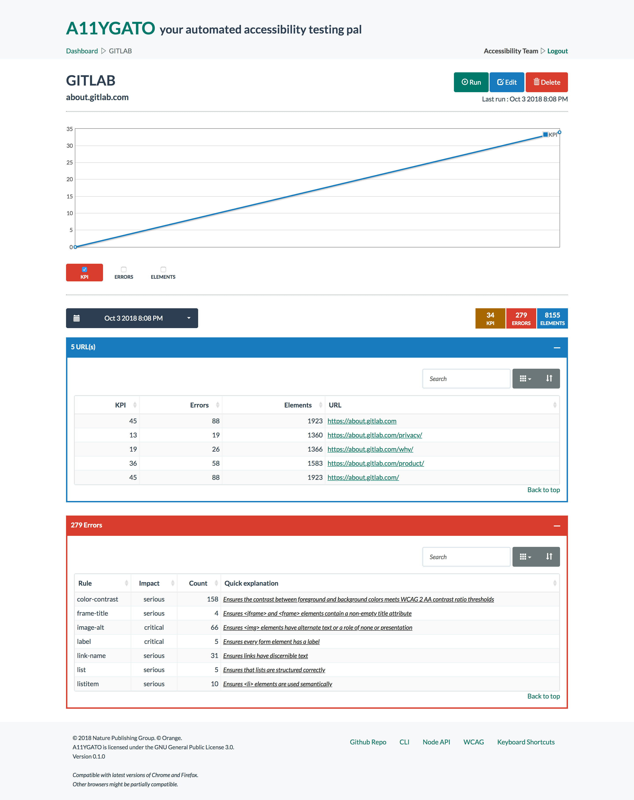

# @a11ygato/dashboard

`@a11ygato/dashboard` is a simple web interface to run audit on urls and supervise their evolution over time via the generation of scores (KPI).
For each url in the audit, you may consult a list of accessibility errors and a screenshot of the page really audited.
You may also use a scenario (a `Puppeteer` script) to create precise audits on distinct domains.



## Setup

`@a11ygato/dashboard` was tested with [Node][node] 8 and npm 5/6.

You may configure a profile in `./config/` folder. 

Configuration options are:
                                                                                         
```json
{
    // TCP port on which the server listen.
	"port": 4000,
	// Path to public RSA key used to check JWT tokens. 
	// You should reuse the same file used by @a11ygato/webservice.
	"auth":{
	    "publicKey": "path/to/file.pem"
    },
    // Path to private and certificate files used for TLS connections (HTTPS).
    "tls":{
        "port": 7443,
        "nat": 444,
        "privateKey": "path/to/file.key",
        "certificate": "path/to/file.crt"
    },
	// TCP host and port of @a11ygato/webservice server.
	"webservice": {
		"host": "127.0.0.1",
		"port": 3000
	},
	// Account ID for Google Analytics.
	"analytics": "<account id>"
}
```

You may create as many as necessary config files.
Each file defines configuration for a different environment. 
If you're just running the application locally, then you should be OK with just `default`. 

`@a11ygato/dashboard` and `@a11ygato/webservice` are two sides of the same coin. 
Don't know why but for historic reasons there is two node servers.
The dashboard is used to serve html (views), the webservice is used to serve json (data).

## Security

You should reuse the public key generated for `@a11ygato/webservice` and configure your config files accordingly:

```javascript
// config/default.js for instance
…
auth:{
    publicKey:'path/to/jwt/pally.pem',
},
tls:{
    privateKey:'path/to/tls/pally.key',
    certificate:'path/to/tls/pally.crt'
}
…
```

It corresponds to [RS256](https://github.com/auth0/node-jsonwebtoken#algorithms-supported) in jsonwebtoken dependency.

## Authentication

This server is not really protected by authentication cause it doesn't serve any data.
The backend server [@a11ygato/webservice](@a11ygato/webservice) providing REST services is the only one protected against unauthorized access with a JWT layer. This choice has been made to minimize costs. 

Regarding, JWT processing:

- each request is analyzed to check for a JWT token in cookies
- if a token is present, its integrity is verified
- if validated, it is send to @a11ygato/webservice as an HTTP header
- any 401 response from @a11ygato/webservice results in a redirection to the sign-in page

## Run

For a simple test, you might start this server manually, just prefix the start command with:

```sh
NODE_ENV=my-profile node index.js
```

**Be aware that you will never start this server directly. You should use the upper npm scripts of `a11ygato-platform`**

## Build

Moved from a chaotic and almost nonexistent grunt file to pure npm scripts. No more bower.

Almost all dependencies (node or browser) are in npm node_modules.
There is a few more in vendor folder:
- `prism`: cause it is generated from their website (very light and with the minimum we need)
- `flot`: cause you can't find them on npm

The build phase do the following:
- lint javascript code
- compile less code to css
- copy resources in public folder
- minify/concatenate javascript dependencies

```bash
npm run build
```

If you want to watch for changes:

```bash
npm run watch
```

TL;DR:

- the `public` folder contains public content served over HTTP
- the `vendor` folder contains static/fixed dependencies doomed to disappear over time if possible
- the `node_modules` contains npm dependencies which are either node or browser dependencies

### A note on Bootstrap

Historically, bootstrap less code had been copied and modified. They were then forced to stay in bootstrap v3.0.1.
I read the git log and found out what had been modified.

I then installed bootstrap from NPM in v3.3.7 and added their modifications in our code.
So now we can upgrade Bootstrap as we see fit.

There is a new `theme` folder inside `less` that contains overrides of bootstrap:
- `bootstrap-flatly.less` is the original file from bootswatch (flatly theme)
- `variables-flatly-custom.less` is a customisation of flatly theme.

Finally there is also `main-bootstrap.less` which is responsible to import bootstrap code.
Some modules have been deactivated cause we are not using them. I only deactivated easy choices.
But I'm pretty sure we can deactivate much more. Just don't have time for the moment to search precisely.

## LightHouse report

Here are the results on several pages (performance/accessibility/best practices/SEO) in april 2018:
- home page: 93/100/88/89
- sign up page: 97/100/88/89
- new task: 89/100/81/89
- task page (30 urls): 80/95/88/89 
- result page (30 urls): 83/95/88/89
- url result page: 90/100/88/89

It would be a good thing to keep an eye on these scores and maintain them :)

There is a few things that impact the score negatively:

- bootstrap v3.3.7 has a known vulnerability that is fixed in v3.4.0. Unfortunately this version is not on NPM yet.
- bootstrap-table plugin uses duplicated IDs in generated code upon which I have no control.
- The whole theme is using a default font size of 15p which is too little on mobile. I don't have time to understand what have been done and reboot font sizes.
- Almost all bootstrap less code is imported. It would help a lot to make tests to detect what is really used. No time neither.


## Analytics

When relevant, I'm rewriting the page path provided to Google Analytics.
For instance, the page url for task `5ad0bdad3666aedabecb9bff` is: `http://<host>/5ad0bdad3666aedabecb9bff`.
We don't want to track each task individually but the task page globally. 
So, I will not submit `/5ad0bdad3666aedabecb9bff` as path for this page, but `/task` instead. 
This is done automatically for each page based on an exhaustive list of page routes.

I'm also tracking some events. They essentially serve one purpose for now: track if a feature is used.

I have created two categories:

- feature => track usage of feature X
- external links => track clicks on external links

## License

[Copyright 2013 Nature Publishing Group](LICENSE.txt).  
@a11ygato/dashboard is licensed under the [GNU General Public License 3.0][gpl].
 

[gpl]: http://www.gnu.org/licenses/gpl-3.0.html
[mongo]: http://www.mongodb.org/
[node]: http://nodejs.org/
[@a11ygato/webservice]: https://github.com/Orange-OpenSource/a11ygato-platform/tree/master/modules/webservice
[@a11ygato/cli]: https://github.com/Orange-OpenSource/a11ygato-platform/tree/master/modules/cli
